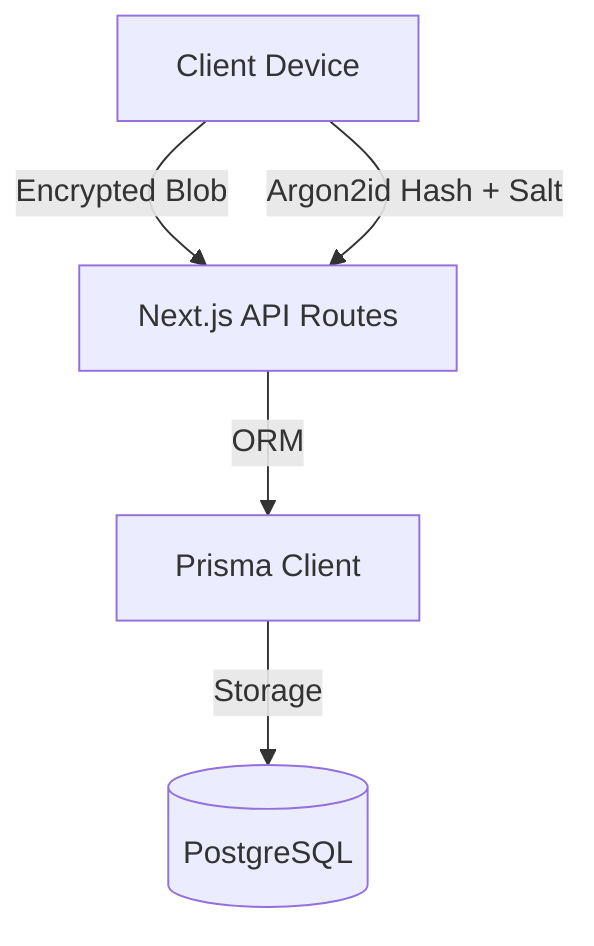

# PwmngerTS 🔐

> ⚠️ **IMPORTANT:** This project is experimental and has not undergone a formal security audit. Do not use it to store highly sensitive passwords yet.

**An open-source, zero-knowledge, cross-platform password manager built with TypeScript and Next.js**

PwmngerTS is a client-side encrypted password manager designed to handle secrets across web and browser extension platforms. All encryption happens **locally on the user's device** — the server never sees plaintext passwords or master keys.

> Inspired by zero-knowledge architectures like Bitwarden, but built for learning, extensibility, and open collaboration.

---

## ✨ Features (v2.0.0)

- 🔐 **Zero-Knowledge Design:** Powered by client-side encryption (Web Crypto API + Argon2id).
- 🎨 **Unified Next.js App:** A single, high-performance App Router codebase for the vault and API.
- 🧩 **Chrome Extension:** Secure browser integration with robust error handling and cloud sync.
- 🛡️ **Advanced MFA:** Support for both **TOTP (2FA)** and **WebAuthn (Passkeys/Security Keys)**.
- 🆘 **Account Recovery:** Secure vault restoration via an Emergency Recovery Kit if you lose your password.
- 🔑 **Master Password Rotation:** Securely change your password with automatic **KDF Salt Rotation**.
- ☁️ **Seamless Sync:** Robust encrypted blob synchronization with conflict resolution.
- 📂 **Organization:** Manage entries with folders and a powerful search interface.

---

## 🏗 Architecture Overview



**Security Guarantees:**
- Backend **NEVER** sees plaintext data.
- Master Password **NEVER** leaves the client (Argon2id KDF).
- Data is encrypted with **AES-256-GCM**.
- Dual-layer authentication using JWT (HTTP-only Cookies + Authorization Headers).

---

## 📁 Project Structure

```
├─ apps/
│  ├─ vault-next/    # Unified Next.js Frontend & API
│  └─ extension/     # Browser Extension (Manifest V3)
│
├─ packages/
│  ├─ crypto/        # Argon2id, AES-GCM, HKDF logic
│  ├─ appLogic/      # Vault management & Auth orchestration
│  ├─ vault/         # Shared data models & migrations
│  ├─ storage/       # Persistence (IndexedDB / Chrome Storage)
│  └─ ui/            # Premium Component Library
```

---

## 🚀 Getting Started

### Prerequisites
- Node.js (v18+)
- pnpm (v8+)
- PostgreSQL (or Supabase)

### Quick Start (Local Dev)

1.  **Clone & Install**
    ```bash
    git clone https://github.com/okikijesutech/PwmngerTS.git
    cd PwmngerTS
    pnpm install
    ```

2.  **Environment Setup**
    Navigate to `apps/vault-next` and create a `.env` file (see `.env.example`).
    ```bash
    cd apps/vault-next
    cp .env.example .env
    npx prisma db push
    ```

3.  **Start Dev Server**
    ```bash
    # From the root directory
    pnpm run dev
    ```

4.  **Access**
    - Web Vault & API: `http://localhost:3000`

---

## 🗺️ Roadmap

- [x] Unified Next.js Migration (v2.0.0)
- [x] Two-factor authentication (TOTP)
- [x] Master Password Salt Rotation
- [x] Emergency Recovery Kit flow
- [x] WebAuthn / Passkey support
- [ ] Browser extension auto-fill integration
- [ ] Vault sharing (Asymmetric E2EE)
- [ ] Mobile app (React Native)

---

## 📜 License

This project is licensed under the **MIT License**.

---

**Built with ❤️ by the PwmngerTS community**
